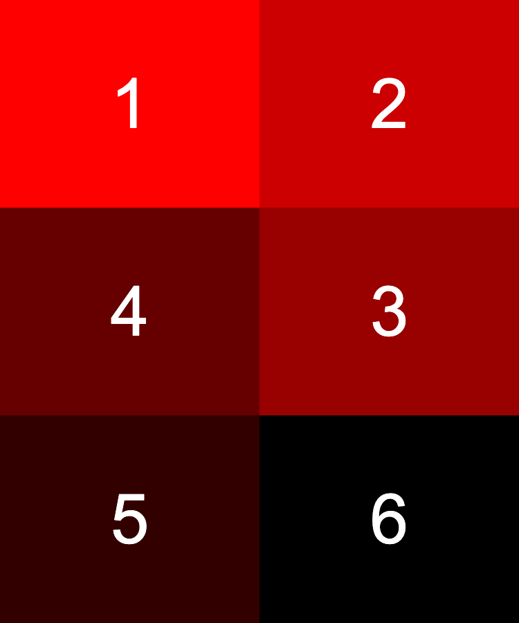

# Boilerplate for layout tasks
Replace `<your_account>` with your Github username and copy the links to Pull Request description:
- [DEMO LINK](https://yevhenii-stanchenko.github.io/layout_snake/)
- [TEST REPORT LINK](https://yevhenii-stanchenko.github.io/layout_snake/report/html_report/)

> Follow [this instructions](https://mate-academy.github.io/layout_task-guideline)

## ❗️❗️❗️ DON'T FORGET TO PROOFREAD YOUR CODE WITH [CHECKLIST](https://github.com/mate-academy/layout_snake/blob/master/checklist.md) BEFORE SENDING YOUR PULL REQUEST❗️❗️❗️

## The task
Display six colored blocks on the screen without any extra margins:

- Use `flexbox`
- Each block should be `300px` high.
- Each block should have its number (1 to 6) placed in its center in white Arial 100px font.
  - Block 1 must be `red`
  - Block 2 must be 4/5 `red` and 1/5 `black`
  - Block 3 must be 3/5 `red` and 2/5 `black`
  - Block 4 must be 2/5 `red` and 3/5 `black`
  - Block 5 must be 1/5 `red` and 4/5 `black`
  - Block 6 must be `black`.
- The width of each block should be not less than its height (`300px`)
- Blocks must be put in 2 to 6 rows and stretched: each row must fit either 1, 2, or 3 blocks.
  See the screenshots [here](./references).
- The first row is to be read from left ro right, the second row from right to left, the third row again from left to right (this way we have a zigzag, or a snake).

---
--> [CHECKLIST](https://github.com/mate-academy/layout_snake/blob/master/checklist.md)

---
## Screenshots

| 3 columns |2columns | 1 column |
| --------- | ------- | -------- |
|  |  |  |

- Используйте `flexbox`
- Каждый блок должен быть высотой 300px.
- Каждый блок должен иметь свой номер (от 1 до 6), размещенный в центре белым шрифтом Arial 100px.
  - Блок 1 должен быть "красным"
  - Блок 2 должен быть 4/5 «красным» и 1/5 «черным».
  - Блок 3 должен быть на 3/5 «красным» и на 2/5 «черным».
  - Блок 4 должен быть на 2/5 «красным» и на 3/5 «черным».
  - Блок 5 должен быть на 1/5 «красным» и на 4/5 «черным».
  - Блок 6 должен быть «черным».
- Ширина каждого блока должна быть не меньше его высоты (`300px`)
- Блоки нужно ставить от 2 до 6 рядов и растягивать: в каждом ряду должно быть 1, 2 или 3 блока.
  Смотрите скриншоты [здесь](./references).
- Первый ряд читаем слева направо, второй ряд справа налево, третий ряд снова слева направо (таким образом получается зигзаг или змейка).

---
--> [КОНТРОЛЬНЫЙ СПИСОК] (https://github.com/mate-academy/layout_snake/blob/master/checklist.md)

---
## Скриншоты

| 3 столбца |2 столбца | 1 столбец |
| --------- | ------- | -------- |
|  |  |  |

[СТИЛИ] — Убедитесь, что вы используете flexbox в своем решении.
[СТИЛИ] - Не пишите слишком много медиа-запросов. У вас есть 3 базовых сценария, поэтому выберите подход — сначала мобильный или рабочий стол — и используйте его в качестве начального (по умолчанию) случая.
[СТИЛИ] - Будьте осторожны, используя правило гибкого порядка. Если вы устанавливаете порядок вручную - не устанавливайте одинаковую стоимость заказа для нескольких товаров, используйте уникальные номера.
[СТИЛИ] — проверьте стили и убедитесь, что вы не пишете стили по умолчанию (например, display: block для div или других).
[ЗАДАНИЕ] - Проверьте свою работу в широком разрешении (> 1600 пикселей). В ряду должно быть не более 3 блоков.
[СТИЛИ] - Привыкайте стилизовать все элементы с помощью классов. И не увеличивайте специфичность селекторов без крайней необходимости.